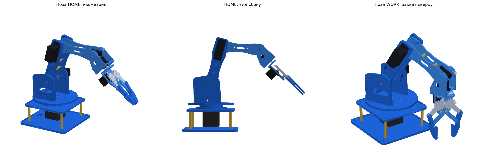

# ROS2 Robotic Arm

Роборука-манипулятор с 6 степенями свободы из оргстекла. Управление на ROS2 + micro-ROS (ESP32), цифровой двойник, обучение движениям и сортировке кубиков.

Авторы: Разгулов Матвей, Клеукин Вячеслав (Б01-501).

## Структура
| Папка | Что там |
|---|---|
| `roboruka_v1/` | механика: параметрические детали (CadQuery), STEP, DXF для лазера, PDF-чертежи, сборка. Подробности в [roboruka_v1/README.md](roboruka_v1/README.md) |
| `RULES.md` | правила совместной работы: модули, статусы деталей, цикл правки |
| _дальше_ | прошивка micro-ROS, ROS2-пакеты, URDF и цифровой двойник |

## Кинематика v1
J1 основание: NEMA17, прямой привод, упорный подшипник 51106 · J2 плечо: MG996R · J3 локоть: MG996R · J4 наклон кисти: MG90S · J5 вращение клешни: MG90S · J6 захват: MG90S.
Плечо и предплечье по 100 мм. Оргстекло 5 мм на силовые детали, 3 мм на кисть и клешню.

